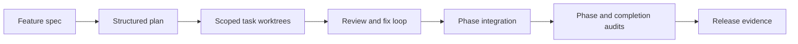

# pm-go

`pm-go` is a durable control plane for AI-assisted software delivery.

Give it a feature spec and a repository. It turns that input into a typed plan,
runs scoped implementation agents in isolated worktrees, reviews the diffs,
merges tasks in dependency order, enforces approvals and budgets, and only calls
the work complete when the evidence passes audit.

Most agent coding tools keep the workflow inside a chat transcript. `pm-go`
moves the workflow into Postgres, Temporal, git worktrees, typed contracts, and
HTTP APIs so runs are resumable, inspectable, and bounded.



## Why It Exists

- **Durable state, not chat memory.** Plans, tasks, approvals, reviews, budgets,
  merge runs, and audits are persisted.
- **Bounded autonomy.** Agents operate inside explicit file scopes and leased
  worktrees instead of open-ended repo access.
- **Evidence-based completion.** A task is not done because an agent says so; it
  is done when diff scope, tests, review, integration, and audit agree.
- **Human intervention where it matters.** Approval gates, overrides, and
  runbooks are first-class product paths, not ad hoc database surgery.
- **Local-first dogfood loop.** The stack runs on Docker, Postgres, Temporal,
  Node, pnpm, and Claude runtimes that can be stubbed for CI.

## Current Status

`pm-go` is a developer-preview monorepo. The local stack is usable for dogfood
and end-to-end smokes, with stub runners for deterministic CI and Claude-backed
runners for live development.

The current tree includes:

- Hono control-plane API for specs, plans, tasks, phases, approvals, artifacts,
  budget reports, events, overrides, completion, and release.
- Temporal worker hosting planning, task execution, review, fix, integration,
  phase audit, completion audit, and final release workflows.
- Drizzle-managed Postgres schema with migrations `0000-0016`.
- Ink TUI for inspecting plans and driving task, phase, completion, and release
  actions.
- Claude SDK/process adapters plus stub runners for repeatable tests.

## Quick Start

Use this when you want to clone the repo, prove the stack is healthy, and then
run your first feature through pm-go.

### 1. Install

Requirements:

- Node `>=22`
- pnpm `>=10`
- Docker, for Postgres and Temporal
- `jq`, for the copy-paste API examples

```bash
git clone https://github.com/alex-reysa/pm-go.git
cd pm-go
pnpm install
cp .env.example .env
pnpm docker:up
pnpm db:migrate
pnpm --filter @pm-go/cli build
pnpm pm-go doctor
```

### 2. Run The Control Plane

Open three terminals from the repo root.

```bash
# Terminal 1: worker
set -a; source .env; set +a
pnpm dev:worker
```

```bash
# Terminal 2: API
set -a; source .env; set +a
pnpm dev:api
```

```bash
# Terminal 3: TUI
pnpm tui
```

The API listens on `http://localhost:3001` by default.

### 3. Submit The Example Feature

```bash
SPEC_JSON=$(
  jq -n \
    --arg title "Add phase detail endpoint" \
    --arg body "$(cat examples/golden-path/spec.md)" \
    --arg repoRoot "$PWD" \
    '{ title: $title, body: $body, repoRoot: $repoRoot }'
)

SPEC_RESPONSE=$(
  curl -sS -X POST http://localhost:3001/spec-documents \
    -H 'content-type: application/json' \
    -d "$SPEC_JSON"
)

SPEC_ID=$(echo "$SPEC_RESPONSE" | jq -r .specDocumentId)
SNAPSHOT_ID=$(echo "$SPEC_RESPONSE" | jq -r .repoSnapshotId)

PLAN_RESPONSE=$(
  curl -sS -X POST http://localhost:3001/plans \
    -H 'content-type: application/json' \
    -d "$(jq -n --arg specDocumentId "$SPEC_ID" --arg repoSnapshotId "$SNAPSHOT_ID" '{ specDocumentId: $specDocumentId, repoSnapshotId: $repoSnapshotId }')"
)

PLAN_ID=$(echo "$PLAN_RESPONSE" | jq -r .planId)
echo "Plan: $PLAN_ID"
```

Then watch the plan in the TUI. The normal operator loop is:

1. Run ready tasks with `g r`.
2. Review tasks with `g v`.
3. Fix tasks with `g f` when review asks for changes.
4. Integrate a phase with `g i`.
5. Audit a phase with `g a`.
6. Complete the plan with `g c`.
7. Release after a passing completion audit with `g R`.

The full walkthrough, including API-only commands and state transitions, lives
in [docs/getting-started.md](docs/getting-started.md).

## Fast Verification

These commands do not require an Anthropic API key.

```bash
pnpm typecheck
pnpm test
pnpm smoke:phase7-matrix
pnpm smoke:phase7-chaos
```

The Docker-backed smoke exercises the durable local stack:

```bash
pnpm smoke:bundle-freshness
pnpm smoke:phase7
pnpm smoke:v082-features
```

## Runtime Modes

Each agent role can run as `stub`, `sdk`, `claude`, or `auto`.

For a live SDK-backed run:

```bash
export ANTHROPIC_API_KEY=sk-ant-...
export PLANNER_RUNTIME=sdk
export IMPLEMENTER_RUNTIME=sdk
export REVIEWER_RUNTIME=sdk
export PHASE_AUDITOR_RUNTIME=sdk
export COMPLETION_AUDITOR_RUNTIME=sdk
pnpm dev:worker
```

`*_RUNTIME` is the canonical configuration surface. The older
`*_EXECUTOR_MODE` variables are still accepted for smoke-script compatibility,
but new docs and manual runs should use `*_RUNTIME`.

See [docs/runtimes.md](docs/runtimes.md) for runtime resolution, CLI-process
mode, policy bridge behavior, and diagnostics.

## Repository Map

- `apps/api`: Hono control-plane API.
- `apps/worker`: Temporal worker and activity host.
- `apps/tui`: Ink terminal operator dashboard.
- `apps/cli`: diagnostics such as `pm-go doctor`.
- `packages/contracts`: shared domain contracts and validators.
- `packages/db`: Drizzle schema and migrations.
- `packages/executor-claude`: Claude runner adapters.
- `packages/worktree-manager`: git branch, worktree, lease, and diff-scope logic.
- `packages/policy-engine`: budget, approval, and stop-condition decisions.
- `packages/observability`: durable span/event conventions.
- `examples`: spec templates and runnable example specs.
- `docs`: architecture, getting started, API, runtime, runbooks, and specs.

## Documentation

Start here:

- [docs/getting-started.md](docs/getting-started.md): first feature from spec
  to release.
- [docs/README.md](docs/README.md): docs map by goal.
- [docs/architecture/overview.md](docs/architecture/overview.md): system model
  and execution sequence.
- [docs/specs/control-plane-api.md](docs/specs/control-plane-api.md): current
  API surface.
- [apps/tui/README.md](apps/tui/README.md): operator dashboard controls.
- [docs/runbooks/](docs/runbooks): recovery paths for blocked tasks, stale
  worktrees, and failed audits.
- [CHANGELOG.md](CHANGELOG.md): release notes.

## Contributing

See [CONTRIBUTING.md](CONTRIBUTING.md) for local setup, branch and commit
conventions, and per-PR test expectations.

Security issues: follow [SECURITY.md](SECURITY.md). Do not open public issues
for vulnerabilities.

## License

Licensed under the Apache License, Version 2.0. See [LICENSE](LICENSE).
