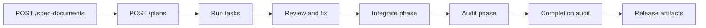

# Getting Started

This guide takes one feature request from spec to release evidence using the
local pm-go stack.

Use the default `stub` runtimes first. They prove the control plane, database,
Temporal workflows, API, worktree leasing, review loop, integration, audits, and
TUI without spending model tokens. Switch to `sdk` or `claude` once the loop is
healthy.

## Mental Model

pm-go is a state machine around agent work:



The user-facing rule is simple: submit a clear spec, then drive the state
machine. pm-go keeps the durable record of what happened.

## Prerequisites

- Node `>=22`
- pnpm `>=10`
- Docker
- `jq` for the curl snippets

## Install And Boot

```bash
git clone https://github.com/alex-reysa/pm-go.git
cd pm-go
pnpm install
cp .env.example .env
pnpm docker:up
pnpm db:migrate
pnpm --filter @pm-go/cli build
pnpm pm-go doctor
```

Start the worker, API, and TUI in separate terminals:

```bash
set -a; source .env; set +a
pnpm dev:worker
```

```bash
set -a; source .env; set +a
pnpm dev:api
```

```bash
pnpm tui
```

Check the API:

```bash
curl -sS http://localhost:3001/health | jq
```

## Submit A Feature Spec

The fastest way to learn the flow is to submit the bundled example:

```bash
SPEC_RESPONSE=$(
  curl -sS -X POST http://localhost:3001/spec-documents \
    -H 'content-type: application/json' \
    -d "$(
      jq -n \
        --arg title "Add phase detail endpoint" \
        --arg body "$(cat examples/golden-path/spec.md)" \
        --arg repoRoot "$PWD" \
        '{ title: $title, body: $body, repoRoot: $repoRoot }'
    )"
)

SPEC_ID=$(echo "$SPEC_RESPONSE" | jq -r .specDocumentId)
SNAPSHOT_ID=$(echo "$SPEC_RESPONSE" | jq -r .repoSnapshotId)
```

That call persists the spec and captures a repo snapshot from `repoRoot`.

Start planning:

```bash
PLAN_RESPONSE=$(
  curl -sS -X POST http://localhost:3001/plans \
    -H 'content-type: application/json' \
    -d "$(
      jq -n \
        --arg specDocumentId "$SPEC_ID" \
        --arg repoSnapshotId "$SNAPSHOT_ID" \
        '{ specDocumentId: $specDocumentId, repoSnapshotId: $repoSnapshotId }'
    )"
)

PLAN_ID=$(echo "$PLAN_RESPONSE" | jq -r .planId)
echo "$PLAN_ID"
```

Inspect the generated plan:

```bash
curl -sS "http://localhost:3001/plans/$PLAN_ID" | jq '.plan | {id, title, status, phases, tasks}'
```

The same plan appears in the TUI plans list.

## Drive The Plan In The TUI

Open the plan in the TUI with `enter`. These are the main operator chords:

| Chord | Action | Server endpoint |
|---|---|---|
| `g r` | Run selected task | `POST /tasks/:taskId/run` |
| `g v` | Review selected task | `POST /tasks/:taskId/review` |
| `g f` | Fix selected task after changes requested | `POST /tasks/:taskId/fix` |
| `g i` | Integrate selected phase | `POST /phases/:phaseId/integrate` |
| `g a` | Audit selected phase | `POST /phases/:phaseId/audit` |
| `g c` | Run completion audit | `POST /plans/:planId/complete` |
| `g R` | Produce release artifacts | `POST /plans/:planId/release` |

Every action opens a confirm modal. The server remains the source of truth; if
an action is too early, the API returns `409` and the TUI shows the reason.

## Drive The Plan With The API

The TUI is the easiest operator surface. The API flow below is useful for
automation and debugging.

List phase and task IDs:

```bash
curl -sS "http://localhost:3001/plans/$PLAN_ID" |
  jq -r '
    .plan.phases[] as $p |
    "phase \($p.index) \($p.id) status=\($p.status)",
    (.plan.tasks[] | select(.phaseId == $p.id) | "  task \(.id) \(.slug) status=\(.status)")
  '
```

Run each task in the active phase:

```bash
curl -sS -X POST "http://localhost:3001/tasks/$TASK_ID/run" \
  -H 'content-type: application/json' \
  -d '{"requestedBy":"local-dev"}' | jq
```

If the task enters review:

```bash
curl -sS -X POST "http://localhost:3001/tasks/$TASK_ID/review" | jq
```

If review asks for changes and the task moves to `fixing`:

```bash
curl -sS -X POST "http://localhost:3001/tasks/$TASK_ID/fix" | jq
```

Repeat review/fix until the task is `ready_to_merge`, or inspect the task when
it blocks:

```bash
curl -sS "http://localhost:3001/tasks/$TASK_ID" | jq
```

When every task in a phase is `ready_to_merge` or `merged`, integrate:

```bash
curl -sS -X POST "http://localhost:3001/phases/$PHASE_ID/integrate" | jq
```

If integration creates pending approvals:

```bash
curl -sS "http://localhost:3001/approvals?planId=$PLAN_ID" | jq
curl -sS -X POST "http://localhost:3001/plans/$PLAN_ID/approve-all-pending" \
  -H 'content-type: application/json' \
  -d '{"approvedBy":"local-dev","reason":"local dogfood approval"}' | jq
```

When the phase is `auditing`, run the phase audit:

```bash
curl -sS -X POST "http://localhost:3001/phases/$PHASE_ID/audit" \
  -H 'content-type: application/json' \
  -d '{"requestedBy":"local-dev"}' | jq
```

Repeat task execution, integration, and audit for each phase. When every phase
is `completed`, run the final audit:

```bash
curl -sS -X POST "http://localhost:3001/plans/$PLAN_ID/complete" \
  -H 'content-type: application/json' \
  -d '{"requestedBy":"local-dev"}' | jq
```

Poll until the latest completion audit passes:

```bash
curl -sS "http://localhost:3001/plans/$PLAN_ID" |
  jq '.latestCompletionAudit | {id, outcome, summary}'
```

Then release:

```bash
curl -sS -X POST "http://localhost:3001/plans/$PLAN_ID/release" | jq
```

## Read State

Useful read endpoints while operating:

```bash
curl -sS "http://localhost:3001/plans" | jq
curl -sS "http://localhost:3001/plans/$PLAN_ID" | jq
curl -sS "http://localhost:3001/phases/$PHASE_ID" | jq
curl -sS "http://localhost:3001/tasks/$TASK_ID" | jq
curl -sS "http://localhost:3001/approvals?planId=$PLAN_ID" | jq
curl -N -H 'accept: text/event-stream' "http://localhost:3001/events?planId=$PLAN_ID"
```

## Use Live Claude Runtimes

Stub mode proves orchestration. Live mode makes real code changes.

```bash
export ANTHROPIC_API_KEY=sk-ant-...
export PLANNER_RUNTIME=sdk
export IMPLEMENTER_RUNTIME=sdk
export REVIEWER_RUNTIME=sdk
export PHASE_AUDITOR_RUNTIME=sdk
export COMPLETION_AUDITOR_RUNTIME=sdk
pnpm dev:worker
```

`*_RUNTIME=auto` is also supported. It prefers SDK when credentials are
available, then the Claude CLI process runtime when `claude` is on `PATH`, then
stub mode.

Run `pnpm pm-go doctor` before a live run. See [runtimes.md](runtimes.md) for
the full runtime model.

## What Good Looks Like

A healthy run leaves behind:

- a persisted `spec_documents` row and `repo_snapshots` row;
- a structured plan with phases, tasks, risks, file scopes, and test commands;
- one worktree lease and agent run evidence per task execution;
- review reports or small-task skip policy decisions;
- merge runs per phase;
- phase audit reports;
- one completion audit report;
- release artifacts only after the completion audit passes.

The important product behavior is not "the agent finished." It is "the system
can show why this result is safe to merge or why it is blocked."

## Common Issues

| Symptom | Fix |
|---|---|
| `DATABASE_URL is required` | Load `.env` before starting API/worker: `set -a; source .env; set +a`. |
| API cannot connect to Temporal | Run `pnpm docker:up` and check `TEMPORAL_ADDRESS=localhost:7233`. |
| No plans in TUI | Start `pnpm dev:api`; verify `curl http://localhost:3001/plans`. |
| Task action returns `409` | The state machine is protecting order. Inspect `GET /tasks/:id` or `GET /phases/:id` and run the previous step first. |
| Live runner starts in stub mode | Set `*_RUNTIME=sdk` or `*_RUNTIME=auto`; new runtime vars override legacy `*_EXECUTOR_MODE`. |
